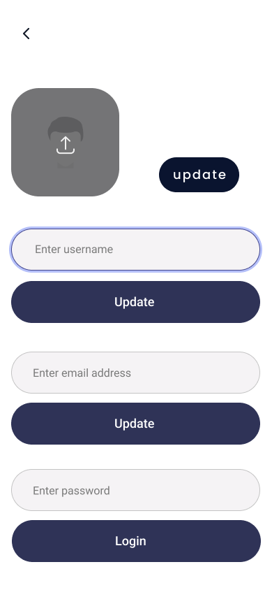

# Youvote

## Description

This is a bespoke web application that allows an organization to create undertake elections. It consist of two
frontends:

1. one for the organization and
2. one for the voters.
3. A server with firebase admin sdk to create and manage voters.

## Technical Details

### Technologies used:

1. [Vite React](https://vitejs.dev/guide/#scaffolding-your-first-vite-project)
2. [Nextjs api routes ](https://nextjs.org/docs/api-routes/introduction),
3. [Storybook ](https://storybook.js.org/) for component development
4. [Firebae](https://firebase.google.com/) for authentication, database storage and file storage
5. [Vercel](https://vercel.com/) for hosting
6. [Yarn workspaces](https://classic.yarnpkg.com/en/docs/workspaces/) for monorepo management
7. [Rollup](https://rollupjs.org/guide/en/) for bundling

### Folder Structure (Monorepo)

1. `apps` contains the frontends
2. `packages` contains the shared components , utils and storybook preview
3. `apps/server` contains the firebase admin sdk server
4. `apps/admin` contains the organization frontend (admin panel)
5. `apps/client` contains the voter frontend
6. `packages/uicore` contains the shared components
7. `packages/ui` storybook preview for the shared components

### How to run the project

1. Clone the repo
2. Run `yarn install` to install all dependencies
3. Create firebase project and add the firebase config to the `.env` file
4. Create firebase admin service account and copy the service account api keys to the `.env` file
5. Write rules for the firestore database and storage. Prevent unauthorized access to the database and storage

### Hosting on vercel

1. Create a vercel account
2. Create a project and link it to the github repo
3. Add the firebase config to the vercel project environment variables
4. Add the firebase admin service account api keys to the vercel project environment variables

#### The command to build the project on vercel

1. client `cd .. && yarn dp-cl`
2. admin `cd .. && yarn dp-ad`
3. ui `cd .. && yarn dp-ui`
4. server `yarn build`, this server and doesnt need the ui componenet to be built on vercel so we wont build
   the uicore directory.

## Design

The designs are also available on figma
[here](https://www.figma.com/file/pWFqRa1H6f02jekfxvEcYv/Untitled?type=design&node-id=0%3A1&t=hDTdffFAks96Cp84-1)

### Admin

1. Sign in page

    
2. Candidates and portfolio page

    
3. Insights page

    
4. Canidate list page

    
5. Settings page

    
6. UpdateInfo page

    

### Client
1. Sign in page

    

2. Vote page
  
      
3. UpdateInfo page

    
